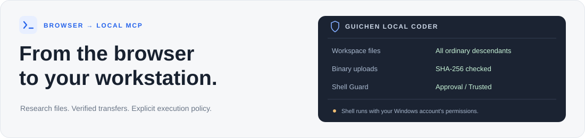

<div align="center">

# Guichen Local Coder

**Your browser. Your files. Your workstation.**

A local MCP bridge for research and development on Windows.

[](https://github.com/kkkklck/guichen-local-coder/actions/workflows/ci.yml)
[](#quick-start)
[](#quick-start)
[](LICENSE)

[Quick start](#quick-start) · [Features](#what-you-can-do) · [Execution policy](#execution-and-safety) · [Tools](#toolbox) · [Documentation](#documentation)

</div>



## What you can do

| Files and data | Execution and reliability |
| :--- | :--- |
| **Work throughout your workspace**<br>Read, edit, create, copy, move, and delete files in one configured directory and its ordinary descendants. | **Inspect commands before they run**<br>Native Windows approval displays the original command, working directory, AI explanation, and backend risk reasons. |
| **Transfer real binary files**<br>Write ZIP, PDF, PNG, DOCX, and other formats from Base64, with ordered chunks, size checks, and final SHA-256 verification. | **Choose an explicit Shell policy**<br>Use one-time approval by default, or deliberately enable trusted execution in your local configuration. |
| **Keep an operation record**<br>Multi-file patches, audit events, and file checkpoints support everyday research and development. | **Recover interrupted connections**<br>Session recovery coalesces reconnects and bounds idle sessions. Optional tunnel supervision handles network readiness and proxy changes. |

> [!IMPORTANT]
> **File tools have a workspace boundary; Shell is not sandboxed.** Approved or trusted commands use your Windows account's permissions and may access files, programs, and networks outside the workspace. Path checks retain TOCTOU risks, and a blacklist cannot guarantee confinement.

## Quick start

**Requirements:** Windows 11, Node.js 22+, and Windows PowerShell 5.1 for native approval. The primary verified setup uses Node.js 24; other operating systems have not completed acceptance testing.

### 1. Install and start

```powershell
git clone https://github.com/kkkklck/guichen-local-coder.git
cd guichen-local-coder
npm ci
node scripts/setup.mjs
npm run build
npm start
```

Setup creates `./workspace` and a local `.env` with separate random MCP and Admin tokens. It does not print tokens or overwrite an existing configuration. The default Shell mode is `approval`.

### 2. Choose your workspace

Edit `WORKSPACE_PATH` in `.env` before starting if you want to use another directory. Configure **one existing ordinary directory**. Its ordinary descendants are accessible; linked roots and multiple roots are rejected.

| Service | Local address |
| :--- | :--- |
| MCP endpoint | `http://127.0.0.1:3000/mcp/<MCP_TOKEN>` |
| Health check | `http://127.0.0.1:3000/health` |
| Admin UI | `http://127.0.0.1:3001/ui` |

Read tokens only from your local `.env`; never publish the authenticated endpoint. Admin APIs require `ADMIN_TOKEN`.

### 3. Connect your client

Forward your own HTTPS tunnel to local port 3000, then configure the token-bearing MCP endpoint in your remote client. ChatGPT feature availability and connection settings depend on the current product and account. Refresh the client's tool list after changing tool definitions.

For the optional OpenAI Tunnel integration, follow [Windows tunnel setup](docs/windows-tunnel.md). No external executable, API key, Tunnel ID, or personal configuration is bundled.

## Execution and safety

| Policy | What happens |
| :--- | :--- |
| `approval` · **default** | Fixed diagnostics such as `python --version` run automatically. Other Shell commands require one-time native Windows approval. |
| `trusted` · **explicit opt-in** | Commands execute without the local approval dialog after the existing block checks. Set `SHELL_GUARD_MODE=trusted` in `.env` and restart to opt in. |

A refusal, window closure, timeout, or IPC failure does not authorize execution. AI explanations are informational and cannot grant system permissions. ChatGPT's own confirmations are managed by the client; this project does not disguise MCP annotations to suppress them.

Dedicated file tools check traversal and linked paths, block workspace-root deletion, and prevent direct `.git` access. Shell side effects are not automatically covered by file-tool checkpoints, and checkpoints are not a complete backup.

Read the full [security boundaries and reporting guidance](SECURITY.md) before exposing a remote service.

## Toolbox

**26 tools** in the default profile, with the full input schemas and safety annotations in the [`tools/list` snapshot](docs/tools.schema.json).

<details>
<summary><strong>Browse the tool catalog</strong></summary>

| Category | Tools |
| :--- | :--- |
| Read and explore | `read_text_file`, `glob`, `grep`, `list_directory` |
| Edit and patch | `write_file`, `edit_file`, `multi_edit`, `apply_patch` |
| Organize files | `create_directory`, `delete_file`, `delete_directory`, `copy_file`, `move_file` |
| Binary transfer | `write_binary_file`, `begin_upload`, `upload_chunk`, `finish_upload` |
| Shell and processes | `run_command`, `shell_status`, `shell_reset`, `start_process`, `process_status`, `process_output`, `stop_process` |
| Document helpers | `extract_pdf_text`, `convert_document_text` |

Direct Git tools, Node REPL, MCP delegation, and other unreviewed execution entrances remain disabled. This edition does not expose every upstream tool.

Optional PDF extraction requires a trusted `pdftotext` installation outside the workspace. Configure `PDFTOTEXT_PATH` if needed; that executable is not bundled. Some admin UI labels retain the upstream language; the native Shell approval dialog currently uses Simplified Chinese.

</details>

> [!NOTE]
> **Binary transfer requires access to the actual bytes.** The client must obtain the complete attachment or generated file, encode it as Base64, and submit tool arguments. A `sandbox:/mnt/data/...` path is not a Windows path or public download URL. Local tests do not establish attachment compatibility in every ChatGPT environment.

## Documentation

| Guide | What it covers |
| :--- | :--- |
| [Windows tunnel setup](docs/windows-tunnel.md) | Credentials, connection status, startup, and isolated tunnel tests |
| [Binary upload protocol](docs/binary-upload.md) | Single-file writes, chunk order, size limits, and SHA-256 checks |
| [Security](SECURITY.md) | Workspace checks, Shell permissions, and private reporting |
| [Contributing](CONTRIBUTING.md) | Development workflow and regression requirements |
| [Release verification](docs/release-verification.md) | Recorded checks and their practical limits |
| [Attribution](NOTICE.md) | Upstream origin, fork baseline, and third-party licensing |

## Development

```powershell
npm run build
npm test
npm run test:setup
npm run test:session-resilience
npm run test:tunnel
npm run check:release
```

Routine tests use temporary directories and mock services. Tunnel supervisor tests do not read real credentials. Regenerate the schema snapshot with `npm run tools:schema`.

<details>
<summary><strong>Test scope and session settings</strong></summary>

`test-live-*`, `test-phase1-security`, approval E2E drivers, and UI capture scripts are manual acceptance tools. They may connect to a running service or display real windows; do not run them in unattended CI or with a personal deployment's `.env`. The optional `test-proxy-routing.mjs` needs a separately installed tunnel client and is not part of the default suite.

| Setting | Default |
| :--- | :--- |
| `MCP_SESSION_TTL_MS` | `1800000` · 30 minutes |
| `MCP_SESSION_MAX` | `512` sessions |
| `MCP_SESSION_RECOVERY_TIMEOUT_MS` | `10000` · 10 seconds |

Idle cleanup does not terminate active or queued requests. When all slots are busy, the server returns 503 with a retry hint. Recovery does not replay a tool after dispatch has begun; client retries of side-effecting operations still require care.

Rate limiting, authentication failures, and connectivity loss are different conditions. Restart loops are not a workaround for remote 429 responses.

</details>

---

**Built on [ChatGPT Local Coder](https://github.com/hoangcoderr/chatgpt-local-coder) by hoangcoderr.** This fork preserves upstream history, the [MIT license](LICENSE), and attribution. Guichen additions are maintained by Guichen Local Coder contributors.

A community project, unaffiliated with OpenAI.
